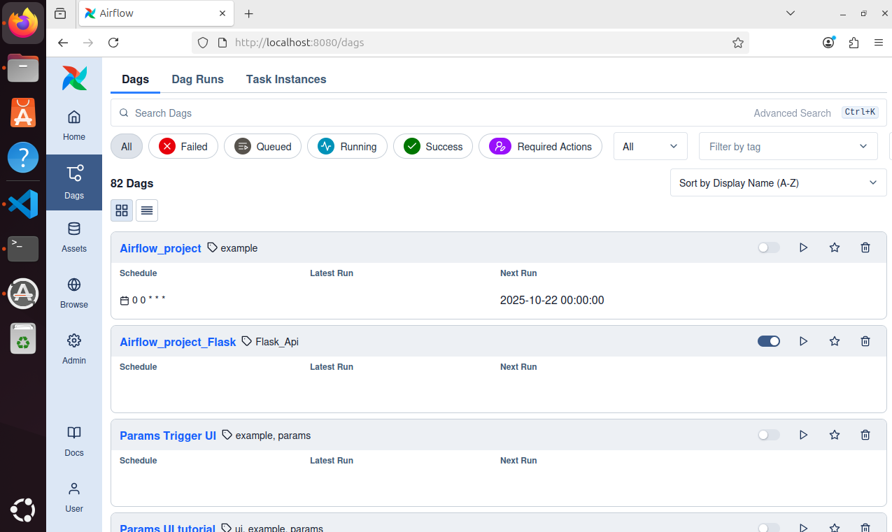
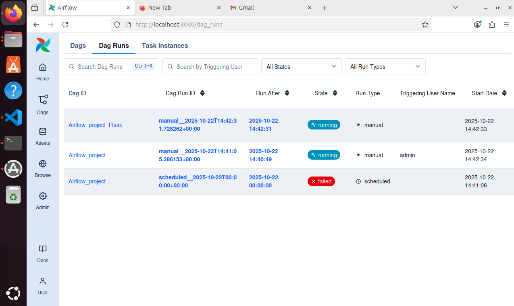
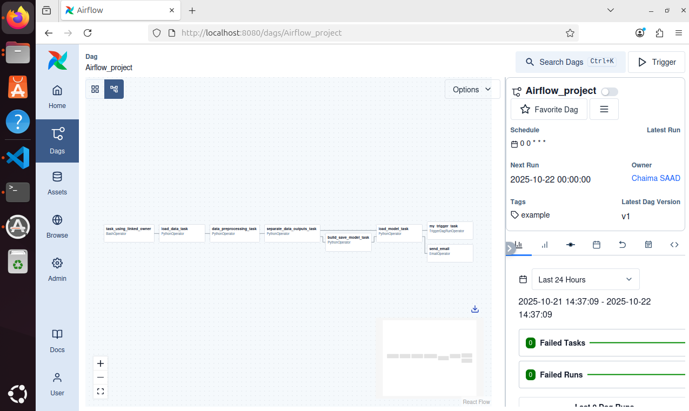
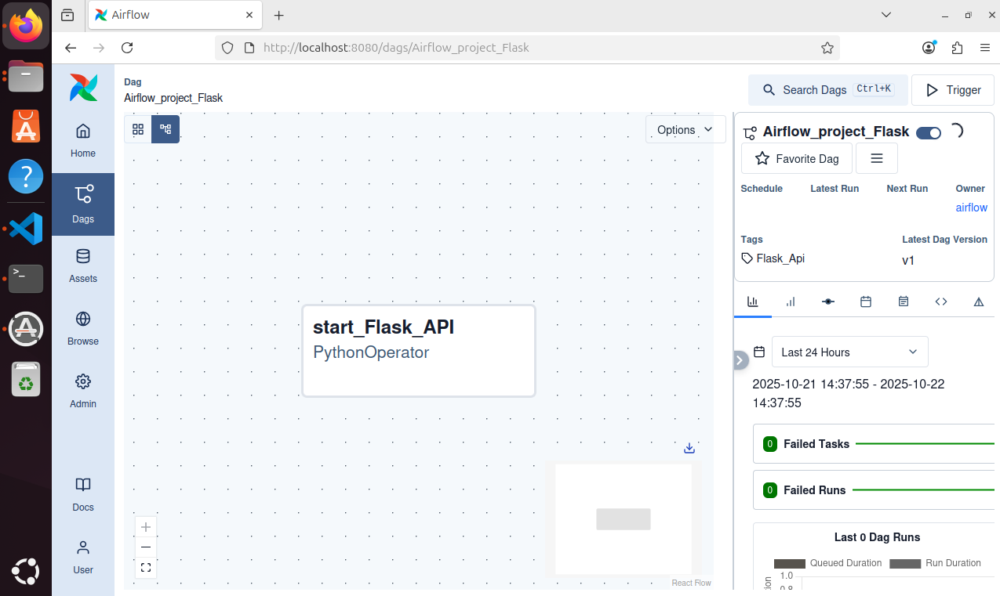
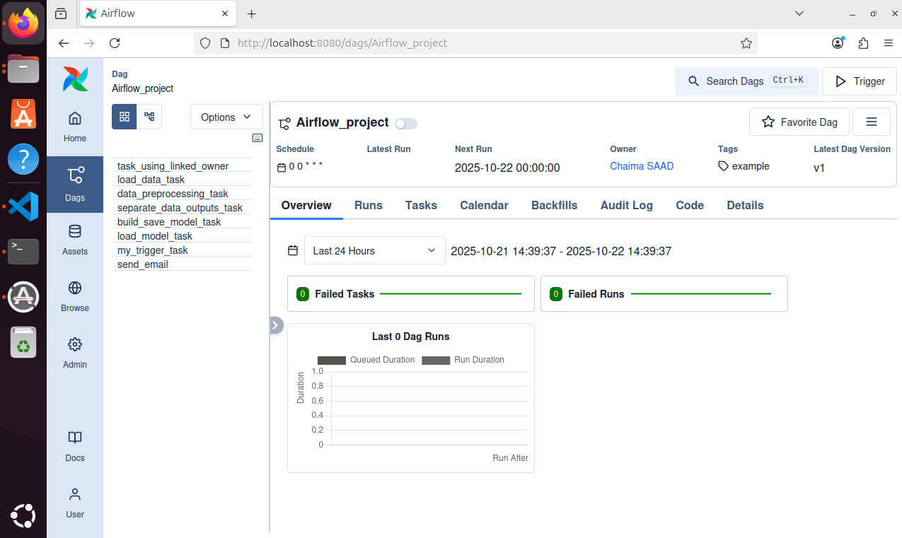
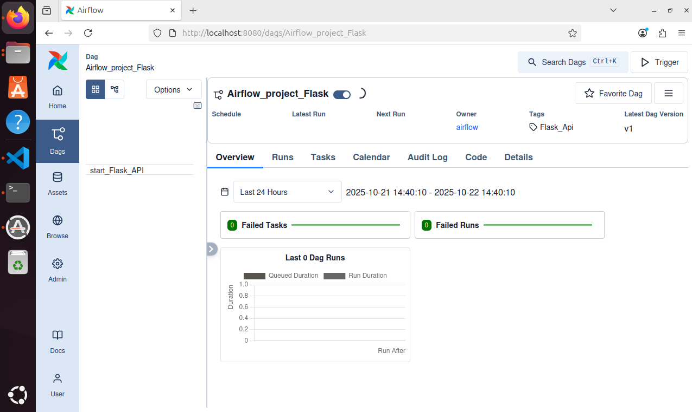
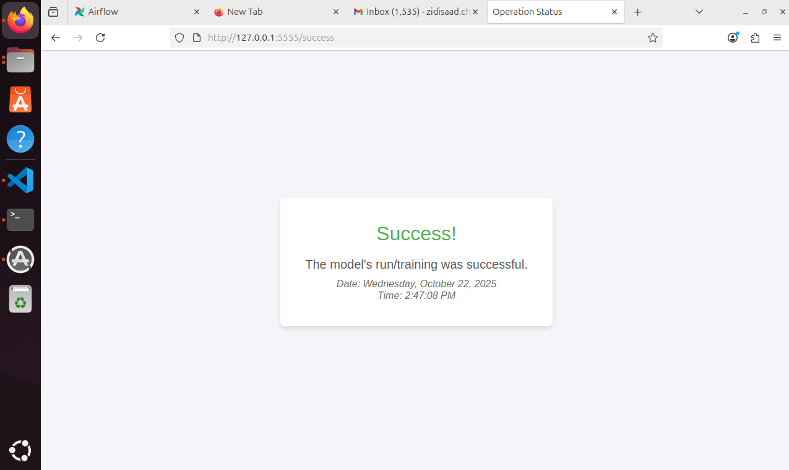
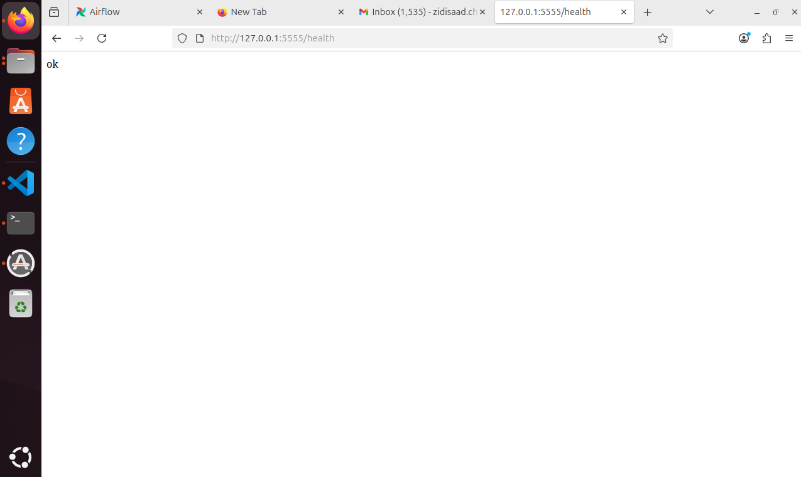
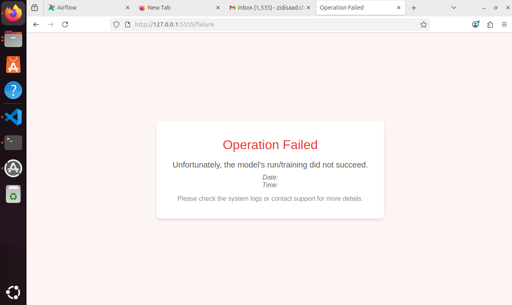

# Orchestration d’un Pipeline ML avec Airflow

Ce projet illustre l’orchestration d’un pipeline de Machine Learning avec Apache Airflow.
L’objectif principal est l’automatisation du workflow d’un modèle déjà existant, et non la conception du modèle lui-même.

Le script model_development.py contient un modèle de régression logistique appliqué au dataset advertising.csv.
Ce script réalise les étapes suivantes :

Chargement du dataset

Prétraitement et séparation train/test

Entraînement et sauvegarde du modèle dans le dossier /model/

## Objectifs pédagogiques

Comprendre la structure d’un DAG Airflow

Orchestrer un pipeline ML complet

Créer des tâches via différents opérateurs Airflow

Gérer les dépendances et callbacks

Relier Airflow à une mini-API Flask pour la supervision du workflow

## Structure du projet

airflow_project
        ├── airflow_venv
        ├── airflow
                ├── dags
                │   ├── data
                │   │   └── advertising.csv
                │   ├── model
                │   ├── src
                │   │   └── model_development.py
                │   ├── templates
                │   │   ├── failure.html
                │   │   └── success.html
                │   ├── Flask_API.py
                │   └── main.py
        └── requirements.txt

## Installation et configuration
1. Prérequis

Python 

Apache Airflow 

Flask 

Scikit-learn

2. Installation des dépendances dans un environnement virtuel

pip install -r requirements.txt

3. Initialisation d’Airflow

export AIRFLOW_HOME=~/airflow_project/airflow

airflow standalone

L’interface Airflow est accessible sur http://localhost:8080

4. Définition du DAG principal: ML pipeline (dags/main.py) 

C'est l’instance principale du workflow ML.
Il inclut plusieurs opérateurs, fonctions et paramètres :
> notify_success(context) et notify_failure(context)

Ces fonctions définissent les notifications e-mail en cas de succès ou d’échec des tâches.
Elles utilisent l’EmailOperator pour envoyer un message prédéfini (sujet + contenu) au destinataire.

> send_email — EmailOperator

Cette tâche envoie un e-mail de notification à la fin du pipeline.
Elle utilise deux fonctions callback :

notify_success — appelée en cas de succès du DAG

notify_failure — appelée en cas d’échec du DAG

Ces fonctions assurent la supervision du pipeline via des alertes automatiques.

> PythonOperator — Tâches du pipeline ML

Ces opérateurs exécutent les fonctions Python issues du script ML et orchestrent les différentes étapes du pipeline :

Tâche	| Fonction exécutée  |	Description
load_data	|load_data()	|Chargement des données
data_preprocessing|	data_preprocessing()	|Nettoyage et transformation
separate_data_outputs |	separate_data_outputs()	|Séparation train/test
build_model	|build_model()	|Entraînement du modèle
load_model	|load_model()	|Chargement du modèle entraîné

> TriggerDagRunOperator

Cette tâche déclenche automatiquement le DAG Airflow_project_Flask lorsque le pipeline ML se termine avec succès.
Elle permet de lancer l’API Flask afin d’afficher l’état du dernier run.
Ces tâches sont exécutées dans l’ordre suivant :

load_data → data_preprocessing → separate_data_outputs → build_model → load_model → send_email

4. Définition du DAG secondaire (dags/Flask_API.py)

Ce DAG gère la mise en route et la supervision de l’API Flask.
Il interagit directement avec le statut du DAG principal et inclut plusieurs fonctions:

> check_dag_status()

Cette fonction interroge le statut du dernier run du DAG principal.
Elle retourne :

True → si le run est réussi

False → sinon

> handle_api_request()

Gère les requêtes API et redirige vers :

/success → si le pipeline a réussi

/failure → en cas d’échec

Ces routes sont affichées via des templates HTML (success.html et failure.html).

> start_flask_app()

Démarre le serveur Flask et expose les routes API :

/api : point d’accès principal

/success : page de succès

/failure : page d’erreur

/health: code de requête  

> start_flask_API — PythonOperator

Cette tâche lance le serveur Flask en exécutant start_flask_app().
Elle représente le point d’entrée du cycle de vie de l’API.

## Notifications

Configurer les variables SMTP dans le fichier airflow.cfg :

smtp_user = "example@gmail.com"
smtp_password = "password"
smtp_host = "smtp.gmail.com"
smtp_port = 587

Activer l’option email_on_failure=True pour recevoir des alertes en cas de problème dans le dictionnaire default_args qui contient les paramètres par défaut du DAG principal, notamment :

La date de début (start_date)

Le nombre de tentatives (retries) en cas d’échec

Les règles d’envoi d’e-mails (succès/échec)

Dans ce qui suit, les captures d'écrans d'Airflow montrant les dags, leurs graphes, les tàches de chaque dag et les tests du l'api Flask:

